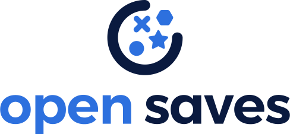

Open Saves is an open-source, purpose-built single interface for multiple storage backends on Google Cloud. 

With Open Saves, game developers can run a cloud-native storage system that is:
- Simple: Open Saves provides a unified, well-defined [gRPC](https://grpc.io/) endpoint for all operations for metadata, structured, and unstructured objects.
- Fast: With a built-in caching system, Open Saves optimizes data placements based on access frequency and data size, all to achieve both low latency for smaller binary objects and high throughput for big objects.
- Scalable: The Open Saves API server can run on either [Google Kubernetes Engine](https://cloud.google.com/kubernetes-engine), or [Cloud Run](https://cloud.google.com/run). Both platforms can scale out to handle hundreds of thousands of requests per second. Open Saves also stores data in Google [Datastore](https://cloud.google.com/datastore) and [Cloud Storage](https://cloud.google.com/storage), and can handle hundreds of gigabytes of data.

For more information, see the [Overview](./docs/overview.md). To get started with deploying Open Saves, check out the [deployment guide](./docs/deploying.md).

For more information about the API, refer to the [API reference](./docs/reference.md).

# Disclaimer

This software is currently alpha, and subject to change. It is not yet ready to be used in production systems.

# Contributing to the project

Check out [How to Contribute](docs/contributing.md) before contributing to the project.

The [Open Saves development guide](docs/development.md) has detailed instructions on getting the source code, making changes, testing, and submitting a pull request to Open Saves.

# Code of Conduct

Participation in this project comes under the [Contributor Covenant Code of Conduct](docs/code-of-conduct.md).

## License

[Apache 2.0](LICENSE)
