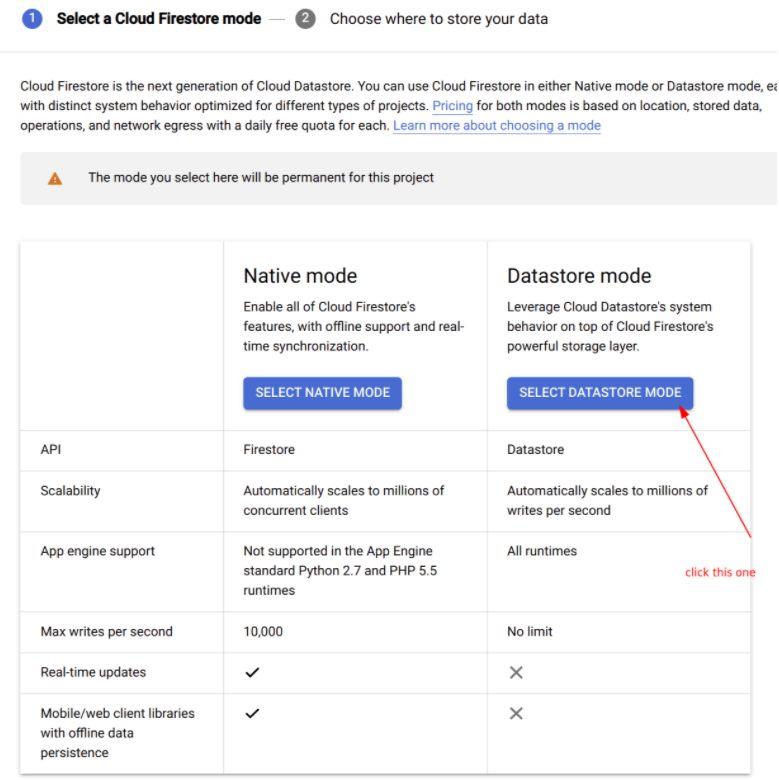
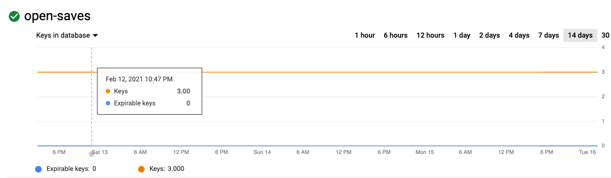

# Deployment Guide

- [Before you begin](#before-you-begin)
- [Setting up backend services on Google Cloud](#setting-up-backend-services-on-google-cloud)
  - [Starting the cache store](#starting-the-cache-store)
  - [Set up Serverless VPC access](#set-up-serverless-vpc-access)
  - [Cloud Firestore in Datastore mode](#cloud-firestore-in-datastore-mode)
  - [Cloud Storage](#cloud-storage)
  - [Deploying your application](#deploying-your-application)
    - [Deploying to Cloud Run](#deploying-to-cloud-run-recommended) (recommended)
    - [Deploying to Google Kubernetes Engine (GKE)](#deploying-to-google-kubernetes-engine-gke)
- [Check to see everything worked](#check-to-see-everything-worked)
  - [Check Datastore](#check-datastore)
  - [Check Memorystore](#check-memorystore)
  - [Check Cloud Storage](#check-cloud-storage)
- [Set up the garbage collector](#set-up-the-garbage-collector)
- [Next steps](#next-steps)

<!-- /TOC -->

This page explains how to deploy an Open Saves server to Cloud Run on MacOS/Linux.

## Before you begin

You may want to create a new Google Cloud project for this quickstart, as we create a Datastore instance
and it can only be done once per project. This also allows you to easily delete
the project after you are done with it.

To build and deploy the Open Saves servers, you need to
install and configure the following:

1. Download and install the [Google Cloud SDK](https://cloud.google.com/sdk/install).

    For more information on installation and set up, see the
    [Cloud SDK Quickstarts](https://cloud.google.com/sdk/docs/quickstarts).

1. Create a new Google Cloud project using the [Google Cloud Console](https://console.cloud.google.com/) or the Google Cloud SDK. See [Creating and managing projects](https://cloud.google.com/resource-manager/docs/creating-managing-projects) for more information.

1. If you plan to deploy your application to Cloud Run, make sure you have [Go v1.14](https://golang.org/doc/install) or later installed.

1. Create a service account using the [Google Cloud Console](https://console.cloud.google.com/) or the Google Cloud SDK. See [Creating a service account](https://cloud.google.com/iam/docs/creating-managing-service-accounts#creating) for more information.

    Save the service account name to an environment variable:
    
    ```bash
    export OPEN_SAVES_GSA=<your service account name here>
    ```

1. Enable Google Cloud APIs needed for running Open Saves.

  ```bash
  gcloud services enable  datastore.googleapis.com \
                          redis.googleapis.com \
                          run.googleapis.com \
                          storage-component.googleapis.com\
                          vpcaccess.googleapis.com
  ```

## Setting up backend services on Google Cloud

You need to set up Memorystore, Cloud Firestore in [Datastore mode (Datastore)](https://cloud.google.com/datastore/docs/firestore-or-datastore), and
Cloud Storage to run the current version of Open Saves.

Memorystore is used for caching records for faster lookups.
Cloud Firestore in Datastore mode (Datastore) is primarily used to manage
metadata of Open Saves. Smaller blob data (usually up to a few kilobytes) could
also be stored in Datastore.
Lastly, Cloud Storage is used to store all large blob data that cannot fit
into Datastore.

First, start by exporting the following environment variables:

```bash
export GCP_PROJECT=$(gcloud config get-value project)
export GCP_REGION=us-central1
export GCP_ZONE=us-central1-c
export REDIS_ID=open-saves-redis
export REDIS_PORT="6379"
export VPC_CONNECTOR=open-saves-vpc
```

### Starting the cache store

Run the following command to create a Redis instance by using [Memorystore](https://cloud.google.com/memorystore). This
will give you an instance with a private IP, which you pass into Open Saves.

```bash
gcloud redis instances create --region=$GCP_REGION $REDIS_ID
```

This may take a while. After this has been created, run the following command to find
the private IP address of this instance:

```bash
gcloud redis instances describe --region=$GCP_REGION $REDIS_ID | grep "host:"
```

Then, save this private IP address to another environment variable:

```bash
export REDIS_IP=<your ip here>
```

### Set up Serverless VPC access

By default, because our Redis instance in Memorystore only has a private IP, we need to create a VPC connector
so that Cloud Run can talk to Memorystore properly.

We will be loosely following [these instructions](https://cloud.google.com/memorystore/docs/redis/connect-redis-instance-cloud-run) to
set up a VPC connector.

First, export your network name.

```bash
export VPC_NETWORK="default"
```

Ensure the previous value matches the output of the following command.

```bash
gcloud redis instances describe $REDIS_ID --region $GCP_REGION --format "value(authorizedNetwork)"
```

Next, enable the Serverless VPC Access API for your project.

```bash
gcloud services enable vpcaccess.googleapis.com
```

Create the VPC connector. This step may take some time.

```bash
gcloud compute networks vpc-access connectors create $VPC_CONNECTOR \
--network $VPC_NETWORK \
--region $GCP_REGION \
--range 10.8.0.0/28
```

Verify that your connector is in the READY state before using it:

```bash
gcloud compute networks vpc-access connectors describe $VPC_CONNECTOR --region $GCP_REGION
```

The output should contain the line state: `READY`.

### Cloud Firestore in Datastore mode

Follow the [quickstart guide](https://cloud.google.com/datastore/docs/quickstart)
to set up a database in **Datastore** mode.



You may choose whichever region you like, however, it can only be specified once
and cannot be undone. Google Cloud Platform currently allows only one Datastore
database per project, so you would need to create a new project to change the
database location.

### Cloud Storage

Cloud Storage is used to store large blobs that don't fit in Datastore.

Create a simple bucket to hold all Open Saves blobs. The bucket needs to have
a globally unique bucket name.

```bash
export BUCKET_PATH=gs://<your-unique-bucket-name>
gsutil mb $BUCKET_PATH
```
### Deploying your application

You can deploy your application to either Cloud Run or Google Kubernetes Engine (GKE).

#### Deploying to Cloud Run (recommended)

Run the following commands to deploy the containerized application to Cloud Run.
This uses the beta version of the Cloud Run service because we are using the
VPC connector and http2 features.

```bash
export TAG=gcr.io/triton-for-games-dev/triton-server:testing
export SERVICE_NAME="open-saves"
gcloud beta run deploy $SERVICE_NAME \
                  --platform=managed \
                  --region=$GCP_REGION \
                  --image=$TAG \
                  --set-env-vars="OPEN_SAVES_BUCKET="$BUCKET_PATH \
                  --set-env-vars="OPEN_SAVES_PROJECT="$GCP_PROJECT \
                  --set-env-vars="OPEN_SAVES_CACHE"=$REDIS_IP":"$REDIS_PORT \
                  --allow-unauthenticated \
                  --vpc-connector $VPC_CONNECTOR \
                  --use-http2
```

Grab the endpoint and save it to an environment variable.

```bash
ENDPOINT=$(\
gcloud run services list \
  --project=$GCP_PROJECT \
  --region=$GCP_REGION \
  --platform=managed \
  --format="value(status.address.url)" \
  --filter="metadata.name="$SERVICE_NAME)

ENDPOINT=${ENDPOINT#https://} && echo ${ENDPOINT}
```

Next, run the example client application to make sure everything worked.

```bash
git clone https://github.com/googleforgames/open-saves
cd open-saves
go run examples/grpc-client/main.go -address=$ENDPOINT:443
```

If you succesfully ran the above client code, you should see some info logged to the command line.
The client code does the following:

1. Creates a store to hold all of our data.
2. Creates a record inside the store.
3. Accesses the record via a `GetRecord` request
4. Creates another record to store our blob.
5. Uploads a blob via the stream in `CreateBlob`.

#### Deploying to Google Kubernetes Engine (GKE)

See [Deploying to Google Kubernetes Engine](deploying-to-gke.md) for this procedure.

## Check to see everything worked

### Check Datastore

In your browser, navigate to the [Datastore dashboard](https://console.cloud.google.com/datastore).
You should see several entities here, from running the example code. Try looking for different
kinds in the search bar at the top, specifically "Store", "Record", "Blob".

### Check Memorystore

While you can't see individual keys directly, navigate to the [Memorystore dashboard](https://console.cloud.google.com/memorystore),
select the instance that you created, and then select the "Keys in database" graph from the dropdown menu. You should
see a few keys like in the screenshot below. It might take a few minutes before the graph is updated.



### Check Cloud Storage

Lastly, navigate to the bucket you created in [the Console](https://console.cloud.google.com/storage).
You should see one object created.

Alternatively, you can use `gsutil` to list the object via command line.

```bash
gsutil ls $BUCKET_PATH
```

## Set up the garbage collector

Open Saves doesn't delete blob objects immediately when the `DeleteBlob` or `DeleteRecord` methods are invoked. Instead, it marks associated objects for future deletion.
You need to run the garbage collector program periodically to remove unused records and objects in Datastore and Cloud Storage.

First, you need to create a virtual machine on [Compute Engine](https://cloud.google.com/compute).
We use the `us-central1-c` zone in this guide, however, you may choose to use another zone. We recommend using
one of the zones in the region that you have the Datastore database. Please refer to [Regions and Zones](https://cloud.google.com/compute/docs/regions-zones)
for more information.

Run the following commands to create a new virtual machine using the same service account you created earlier in this guide.

```bash
export GC_VM_NAME=collector-vm

gcloud compute instances create $GC_VM_NAME \
    --service-account=$OPEN_SAVES_GSA@$GCP_PROJECT.iam.gserviceaccount.com \
    --scopes=https://www.googleapis.com/auth/cloud-platform --machine-type=e2-micro \
    --image-family=cos-85-lts --image-project=cos-cloud --zone=$GCP_ZONE
```

Wait for the virtual machine to start. It may take a few minutes.

Next, log in to the virtual machine by running:

```bash
gcloud compute ssh $GC_VM_NAME --zone=$GCP_ZONE
```

You can run the garbage collector with the following command after logging into the machine:

```bash
docker run gcr.io/triton-for-games-dev/open-saves-collector:testing
```

You may want to automate the execution. In this guide, we will use systemd to run the
garbage collector once an hour.

First, copy [open-saves-gc.service](../deploy/systemd/open-saves-gc.service) and
[open-saves-gc.timer](../deploy/systemd/open-saves-gc.timer) to the `/etc/systemd/system`
directory of the virtual machine.

``` bash
curl https://raw.githubusercontent.com/googleforgames/open-saves/main/deploy/systemd/open-saves-gc.service | sudo tee /etc/systemd/system/open-saves-gc.service
curl https://raw.githubusercontent.com/googleforgames/open-saves/main/deploy/systemd/open-saves-gc.timer | sudo tee /etc/systemd/system/open-saves-gc.timer
```

Next, enable the units with the `systemctl` command.

```bash
sudo systemctl daemon-reload
sudo systemctl enable open-saves-gc.service open-saves-gc.timer
sudo systemctl start open-saves-gc
```

Now the garbage collector runs automatically every hour as long as the virtual machine is running.
You can check the current status by running `systemctl status`, for example:

```bash
sudo systemctl status open-saves-gc.service
sudo systemctl status open-saves-gc.timer
```

## Next steps

You have successfully deployed an Open Saves server on Cloud Run, saved data to it, and then read that data back from it.

The basic Open Saves server **does not have authentication / authorization**. We recommend following this guide on [Authenticating service-to-service](https://cloud.google.com/run/docs/authenticating/service-to-service) to add proper authentication before deploying to production.
