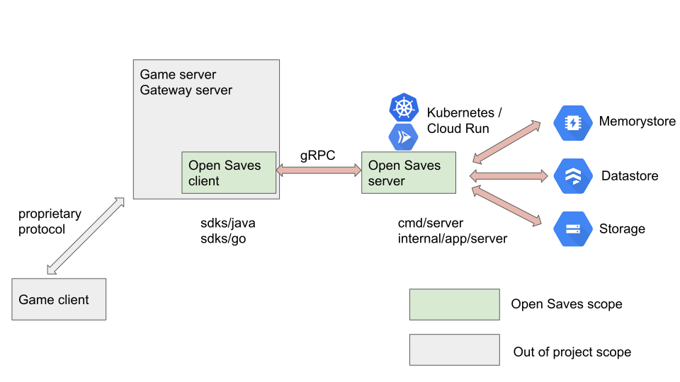

# Overview

Open Saves is a platform-agnostic cloud storage and save solution that supports the following:

*  **Multi-tenancy separation**: Enforces separation at the user, game, studio, and publisher levels.
*  **Robust and granular read/write controls on data**: This solution offers flexibility over when a user can, or cannot, see certain pieces of data. For example, flip a bit and a user can see an active promotion, but won't see it later after the promo is over.
*  **Hybrid environments**: Environments could span from a data center to bursting in the cloud.
*  **Structured & unstructured data**: Use metadata or binary data to accommodate your specific use cases, such as saving the game state for pause/resume operations, or level content for patching.

## Storage options

This system supports three types of storage:

*  Cache store: High speed write-through cache for fastest retrieval
*  Structured store: Persistent store for structured data. Default high speed persistent storage for cloud save data < 1MB.
*  Bulk store - External object storage for persistence of larger assets (> 1MB)

Structured storage and bulk storage are available using API interfaces, which abstract the underlying implementation. This provides the ability to plug and play different engines to optimize for cost or cloud provider. Data access is cached whenever possible for faster retrieval of commonly accessed data.

## Sample implementation

The following data flow diagram is for a sample implementation of Open Saves using Google Cloud products.

<!-- Source: https://docs.google.com/presentation/d/1zisi2ICUpS1BhrUEVX8Jbxd0I5agOclkwgekC8IbCgE/edit#slide=id.p -->

[Memorystore](https://cloud.google.com/memorystore) is used to cache small records for faster retrieval of commonly-accessed data. This is done automatically by Open Saves, but hints can be used to explicitly allow/disallow caching of records.

[Firestore in Datastore mode](https://cloud.google.com/datastore/docs) (Datastore) is primarily used to manage metadata of Open Saves. Smaller blob data (usually up to a few kilobytes) can also be stored in Datastore.

[Cloud Storage](https://cloud.google.com/storage) is used to store large blobs that don't fit in Datastore.

## Get started

To get started with deploying Open Saves, check out the [deployment guide](deploying.md).

